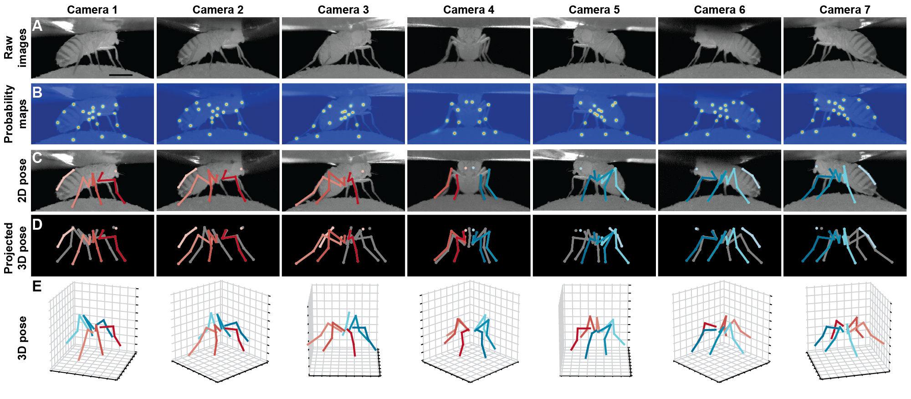
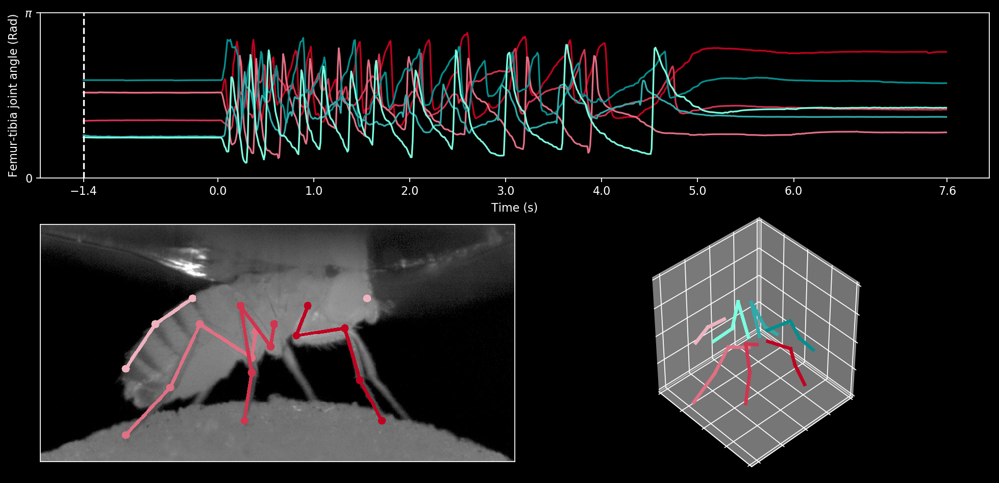
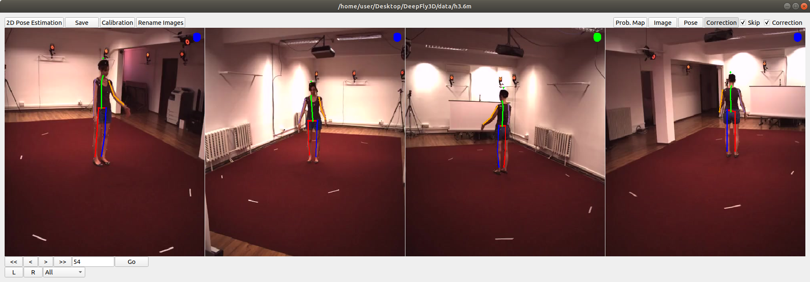

# DeepFly3D
[](https://www.gnu.org/licenses/gpl-3.0)


DeepFly3D is a PyTorch and PyQT5 implementation of 2D-3D tethered Drosophila pose estimation. It aims to provide an interface for pose estimation and to permit further correction of 2D pose estimates, which are automatically converted to 3D pose. 

DeepFly3D **does not require a calibration pattern**, it enforces **geometric constraints using pictorial structures**, which corrects most of the erros, and the **remaining errors are automatically detected can be dealt easily with GUI assistance**.

Code for data preparation and augmentation are taken from the [Stacked hourglass network](https://github.com/anewell/pose-hg-train). We also use the Stacked Hourglass model for 2D pose estimation. We implement custom advances (e.g., GUI) using PyQT5.

* Installing DeepFly3D: [Installation](https://github.com/NeLy-EPFL/DeepFly3D/blob/master/docs/install.md)
* Interacting with the GUI:  [GUI](https://github.com/NeLy-EPFL/DeepFly3D/blob/master/docs/gui.md)
* If you want to train 2D estimator instead: [2D Pose](https://github.com/NeLy-EPFL/DeepFly3D/blob/master/docs/terminal.md)
* Generating visualizations: [Visualization](https://github.com/NeLy-EPFL/DeepFly3D/blob/master/docs/visual.md)
* If you are interested in the online annotation tool instead: [DeepFly3DAnnotation](https://github.com/NeLy-EPFL/DeepFly3DAnnotation)
* To see the whole dataset used in the paper: [Dataverse](https://dataverse.harvard.edu/dataverse/DeepFly3D)
* Adapting DeepFly3D on different datasets: [Adapting (Will be updated soon)](https://github.com/NeLy-EPFL/DeepFly3D/blob/master/docs/adapt.md)

## Changes
### Changes in 0.4

- Using the CLI, the output folder can be changed using the `--output-folder` flag
- CLI and GUI now use the same pose estimation code, so changes will automatically propagate to both
- Minor tweaks in the GUI layout, functionality kept unchanged

### Changes in 0.3
- Results are saved in df3d folder instead of the image folder.
- Much faster startup time. 
- Cameras are automatically ordered using Regular Expressions.
- CLI improvements. Now it includes 3D pose.

### Changes in 0.2
- Changing name from deepfly3d to df3d
- Adding cli interface with df3d-cli
- Removing specific dependencies for numpy and scipy
- Removing L/R buttons, so you can see all the data at once
- Removing the front camera
- Faster startup time, less time spent on searching for the image folder
- Better notebooks for plotting
- Adding procrustes support. Now all the output is registere to template skeleton.
- Bug fixes in CameraNetwork. Now calibration with arbitrary camera sequence is possible.

### Known Problems
- Some insability in automatic correction

## GUI

DeepFly3D provides a nice GUI to interact with the data. Using DeepFly3D GUI, you can visualize:

* Raw data
* Probability maps
* Raw predictions
* Automatic corrections

And you can perform:

* 2D pose estimation
* Calibration without calibration pattern
* Saving the final 3D estimations
* Manual Correction

### Identifying erroneous estimates automatically

DeepFly3D can automatically detect when 2D pose estimation is failed. 

### Auto-correction

DeepFly3D will try to fix these mistaked using multi-view geometry and pictorial structures. In the next iteration of training, you can also use these examples to train the 2D estimation network! Auto-correction is perfomed if 2D pose estimation and calibration are complete.

### Assisting manual correction
 In the 'Correction' mode, the GUI tries to correct errors using pictorial structures. To save these corrections, press ```T```. Please check the associated manuscript (Günel et al. 2019) for implementation details.

In the next iteration of training, you can use these examples to train the network!

### Visualization
And nice visualizations! Check the [Visualization](https://github.com/NeLy-EPFL/DeepFly3D/blob/master/docs/visual.md) doc for details.
In general, displaying pose estimation results should be as easy as:

```python
import matplotlib.pyplot as plt
from deepfly.CameraNetwork import CameraNetwork
camNet = CameraNetwork(image_folder=image_folder)
image_folder = './data/test'

plt.imshow(camNet.cam_list[1].plot_2d())
```
and to display heatmaps: 

```python
plt.imshow(camNet.cam_list[1].plot_heatmap())
```

To create more complicated figures, or replicate the figures from the paper, you can use the the pose_result file which is saved in the same folder as the images. The notebook, ```notebook_visualize/visualize.ipynb```, shows you the steps to create the following figure:



To visualize the time series instead, use the notebook ```notebook_visualize/time_series.ipynb```. It should output 2D/3D pose, along with a few selected time series.

<p align="center">

</p>

### Using different datasets
It is possible to use DeepFly3D on other animals! Check the [Adaptation](https://github.com/NeLy-EPFL/DeepFly3D/blob/master/docs/adapt.md) text to see an example of [H3.6m](http://vision.imar.ro/human3.6m/description.php) multi-view human dataset.

<p align="center">

</p>


### References
```
@inproceedings{Gunel19DeepFly3D,
  author    = {Semih Gunel and
               Helge Rhodin and
               Daniel Morales and
               João Compagnolo and
               Pavan Ramdya and
               Pascal Fua},
  title     = {DeepFly3D, a deep learning-based approach for 3D limb and appendage tracking in tethered, adult Drosophila},
  bookTitle = {eLife},
  doi       = {10.7554/eLife.48571},
  year      = {2019}
}

@inproceedings{Newell16Stacked,
  author    = {Alejandro Newell and
               Kaiyu Yang and
               Jia Deng},
  title     = {Stacked Hourglass Networks for Human Pose Estimation},
  booktitle = {Computer Vision - {ECCV} 2016 - 14th European Conference, Amsterdam,
               The Netherlands, October 11-14, 2016, Proceedings, Part {VIII}},
  pages     = {483--499},
  year      = {2016},
  doi       = {10.1007/978-3-319-46484-8\_29},
}
```

We want to thank to Florian Aymanns for testing of the software and for his helpful comments.
