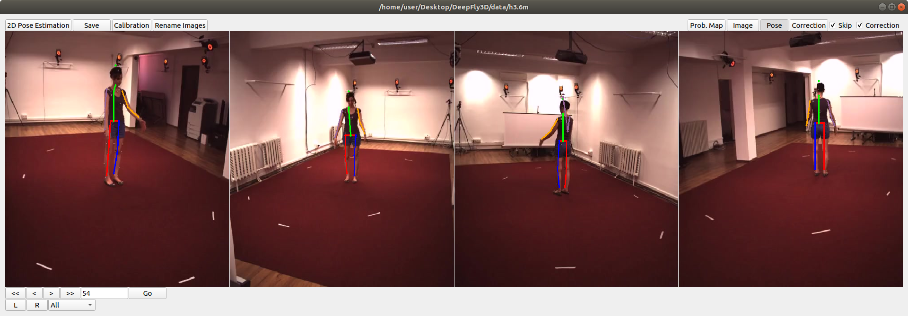

## Adapt
**DeepFly3D will receive a large update soon to make it easier to adapt into new datasets.**

As DeepFly3D does not assume a circular camera arrangement or that there is one degree of freedom in the camera network, it could easily be adapted for 3D pose estimation in other animals, ranging from rodents to primates and humans. We illustrate this flexibility by using DeepFly3D to capture human 3D pose in the Human 3.6M Dataset (http://vision.imar.ro/human3.6m/description.php), a very popular, publicly available computer vision benchmarking dataset generated using four synchronized cameras.

Generally, for any new dataset, the user first needs to provide an initial set of manual annotations. The user would describe the number of tracked points and their relationships to one another in a python setup file. Then, in a configuration file, the user specify the number of cameras along with the resolutions of input images and output probability maps. DeepFly3D will then use these initial manual annotations to (i) train the 2D Stacked Hourglass network, (ii) perform camera calibration without an external checkerboard pattern, (iii) learn the epipolar geometry to perform outlier detection, and (iv) learn the segment length distributions S_{i,j}. After this initial bootstrapping, DeepFly3D can be then used with pictorial structures and active learning to iteratively improve pose estimation accuracy.

The initial manual annotations can be performed using the DeepFly3D Annotation GUI. Afterwards, these annotations can be downloaded from the Annotation GUI as a CSV file using the **Save** button. Once the CSV file is placed in the images folder, DeepFly3D will automatically read and display the annotations. To train the Stacked Hourglass network, use the csv-path flag while running pose2d.py (found in deepfly/pose2d). DeepFly3D will then train the Stacked Hourglass network by performing transfer learning using the large MPII dataset and the smaller set of user manual annotations.

To perform camera calibration, the user should select the Calibration button on the GUI. DeepFly3D will then perform bundle adjustment and save the camera parameters in calibration.pickle (found in the images folder). The path of this file should then be added to Config.py to initialize calibration. These initial calibration parameters will then be used in further experiments for fast and accurate convergence.  If the number of annotations is insufficient for accurate calibration, or if bundle adjustment is converging too slowly, an initial rough estimate of the camera locations can be set in Config.py. As long as a calibration is set in Config.py, DeepFly3D will use it as a projection matrix to calculate the epipolar geometry between cameras. This step is necessary to perform outlier detection on further calibration operations. 

DeepFly3D will also learn the distribution S_{i,j}, whose non-zero entries are found in skeleton.py. One can easily calculate these segment length distribution parameters using the functions provided with DeepFly3D. CameraNetwork class (found under deepfly/GUI/), will then automatically load the points and calibration parameters from the images folder. The function CameraNetwork.triangulate will convert 2D annotation points into 3D points using the calibration parameters. The S_{i,j} parameters can then be saved using the pickle library (the save path can be set in Config.py. The calcBoneParams method will then output the segment lengths' mean and variance. These values will then be used with pictorial structures. 

## Examples

