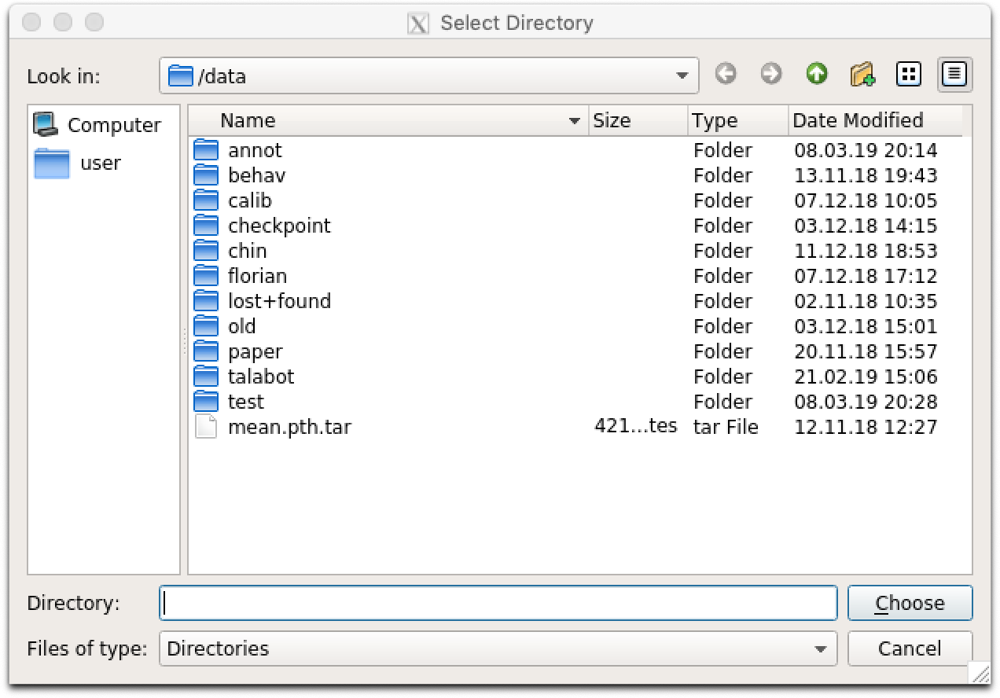

<a href="https://github.com/psf/black"></a>
[](https://www.gnu.org/licenses/gpl-3.0)
[](https://badge.fury.io/py/df3d)


DeepFly3D is a PyTorch and PyQT5 implementation of 2D-3D tethered Drosophila pose estimation. It aims to provide an interface for pose estimation and to permit further correction of 2D pose estimates, which are automatically converted to 3D pose.

DeepFly3D does not require a calibration pattern, it enforces geometric constraints using pictorial structures, which corrects most of the errors, and the remaining errors are automatically detected can be dealt manually with GUI.

Table of Contents:
- [Data Structure](#data-structure)
  * [Basic Usage](#basic-usage)
- [Advanced Usage](#advanced-usage)
- [Python Interface](#python-interface)
- [Videos](#videos)
- [Output](#output)
  * [Points2d](#points2d)
  * [Camera Ordering](#camera-ordering)
  * [Heatmap Confidence](#heatmap-confidence)
- [GUI](#gui)
- [Output](#output-1)

Extras:
* If you are interested in the online annotation tool instead: [DeepFly3DAnnotation](https://github.com/NeLy-EPFL/DeepFly3DAnnotation)
* To see the dataset used in the paper: [Dataverse](https://dataverse.harvard.edu/dataverse/DeepFly3D)


# Installing

## Installing with pip
Create a new anaconda environment, and pip install df3d package.
```bash
conda create -n df3d python=3.6
conda activate df3d
pip install df3d
```

## Old CUDA Drivers
**Only in case your cuda driver is not up-to-date**, additionally you might need to explicitly install cudatoolkit before pip installing df3d:

```bash
conda install pytorch torchvision torchaudio cudatoolkit="YOUR_CUDA_VERSION" -c pytorch
```

## Installing from the source
DeepFly3D requires Python3, Anaconda environment and CUDA drivers for installation. It is __only tested on Ubuntu and MacOS__. First, clone the repository:

```
git clone https://github.com/NeLy-EPFL/DeepFly3D
cd DeepFly3D
```
Then, run create a conda environment with
```
conda create -n df3d python=3.6
```
which will create a new python environment. Then, activate the environment.
```
conda activate df3d
```
Once this is done  you can install the **df3d** package with the following command,

```
pip install -e .
```

which uses the setup.py function to create the package.

Make sure you also have installed the CUDA drivers compatible with your GPU, otherwise it is not possible to make 2D predictions. You can check how to install CUDA drivers here: https://developer.nvidia.com/cuda-downloads


# Data Structure

The inteded usage of DeepFly3D is through command-line-intarface (CLI).
df3d-cli assumes there are videos or images in this format under the folder. 
if your path /your/image/path has images or videos, df3d-cli will run 2D pose estimation, calibration and triangulation and will save 2d pose, 3d pose and calibration parameters under the folder /your/image/path/df3d.

Idealy you would have images or videos under ```images/``` folder, with the specific naming convention:
```
.
+-- images/
|   +-- camera_0_img_0.jpg
|   +-- camera_1_img_0.jpg
|   +-- camera_2_img_0.jpg
|   +-- camera_3_img_0.jpg
|   +-- camera_4_img_0.jpg
|   +-- camera_5_img_0.jpg
|   +-- camera_6_img_0.jpg
...
```
or 

```
.
+-- images
|   +-- camera_0.mp4
|   +-- camera_1.mp4
|   +-- camera_2.mp4
|   +-- camera_3.mp4
|   +-- camera_4.mp4
|   +-- camera_5.mp4
|   +-- camera_6.mp4
```

In case of mp4 files, df3d will first expand them into images using ffmpeg. Please check the sample data for a real exampe: https://github.com/NeLy-EPFL/DeepFly3D/tree/master/sample/test

## Basic Usage

The basic usage is like this.
```bash
df3d-cli /your/image/path \
         --order 0 1 2 3 4 5 6 
```

camera order stands for the selection of cameras. The default camera ordering (0 1 2 3 4 5 6) stands for this. In case you have some other order, then you need to  tell which order.


Originally. 


Then if you have the following order, your


So for example, if your data looks like this, then your order should be 6 5 4 3 2 1 0.


# Advanced Usage

```bash
usage: df3d-cli [-h] [-v] [-vv] [-d] [--output-folder OUTPUT_FOLDER] [-r] [-f]
                [-o] [-n NUM_IMAGES_MAX]
                [-order [CAMERA_IDS [CAMERA_IDS ...]]] [--video-2d]
                [--video-3d] [--skip-pose-estimation]
                INPUT

DeepFly3D pose estimation

positional arguments:
  INPUT                 Without additional arguments, a folder containing
                        unlabeled images.

optional arguments:
  -h, --help            show this help message and exit
  -v, --verbose         Enable info output (such as progress bars)
  -vv, --verbose2       Enable debug output
  -d, --debug           Displays the argument list for debugging purposes
  --output-folder OUTPUT_FOLDER
                        The name of subfolder where to write results
  -r, --recursive       INPUT is a folder. Successively use its subfolders
                        named 'images/'
  -f, --from-file       INPUT is a text-file, where each line names a folder.
                        Successively use the listed folders.
  -o, --overwrite       Rerun pose estimation and overwrite existing pose
                        results
  -n NUM_IMAGES_MAX, --num-images-max NUM_IMAGES_MAX
                        Maximal number of images to process.
  -order [CAMERA_IDS [CAMERA_IDS ...]], --camera-ids [CAMERA_IDS [CAMERA_IDS ...]]
                        Ordering of the cameras provided as an ordered list of
                        ids. Example: 0 1 4 3 2 5 6.
  --video-2d            Generate pose2d videos
  --video-3d            Generate pose3d videos
  --skip-pose-estimation
                        Skip 2D and 3D pose estimation
```

Therefore, you can create advanced queries in df3d-cli, for example:

```bash
df3d-cli -f /path/to/text.txt    \  # process each line from the text file 
         -r                      \  # recursively search for images folder under each line of the text line
         --order 0 1 2 3 4 5 6   \  # set the camera order
         -n 100                  \  # process only the first 100 images 
         --output-folder results \  # write results under  /your/image/path/results instead of  /your/image/path/df3d
         --vv                    \  # will print agressivelly, for debugging purposes
         --skip-pose-estimation  \  # will not run 2d pose estimation, instead will do calibration, triangulation and will save results
         --video-2d              \  # will make 2d video for each folder 
         --video-3d              \  # will make 3d video for each folder
```

To test df3d-cli, you run it on a folder for only 100 images, make videos, and print agressivelly for debugging:

```bash 
df3d-cli /path/to/images/ -n 100 -vv -order 0 1 2 3 4 5 6
```

# Python Interface
Optinally, you can also use df3d on directly python. 

```python
from df3d.core import Core
from df3d import video

core = Core(input_folder='../sample/test/', num_images_max=100, output_subfolder='df3d_py', camera_ordering=[0,1,2,3,4,5,6])
core.pose2d_estimation()
core.calibrate_calc(min_img_id=0, max_img_id=100)

# save df3d_resultt  file under '../sample/test/df3d_py' 
core.save()

# make videos
video.make_pose2d_video(
    core.plot_2d, core.num_images, core.input_folder, core.output_folder
)
video.make_pose3d_video(
    core.get_points3d(),
    core.plot_2d,
    core.num_images,
    core.input_folder,
    core.output_folder,
)
```
# Videos 


https://user-images.githubusercontent.com/20509861/150675465-fc5b52a7-9fa0-4782-b48f-828bd03fc93c.mp4


https://user-images.githubusercontent.com/20509861/150675462-4d438faa-c3bb-4392-b6bd-5be266dd55e0.mp4


# Output

df3d-cli saves results under df3d_result.pk file. You can read it using,
```python
result_path = '../sample/test/df3d/df3d_result*.pkl'
d = pickle.load(open(glob.glob(pr_path)[0], 'rb'))
```
This will read a dictionary with the following keys:
```python
d.keys()
>>> dict_keys([0, 1, 2, 3, 4, 5, 6, 'points3d', 'points2d', 'points3d_wo_procrustes', 'camera_ordering', 'heatmap_confidence'])
```
## Points2d
You can also visualize which keypoints in results belongs to which keypoints on the animal:
```python
import matplotlib.pyplot as plt

image_path = '../sample/test/camera_{cam_id}_img_{img_id}.jpg'
pr_path = '../sample/test/df3d/df3d_result*.pkl'

plt.imshow(plt.imread(image_path.format(cam_id=0,img_id=0)))
plt.axis('off')
for i in range(19):
    x, y = d['points2d'][0, 0][i, 1] * 960, d['points2d'][0, 0][i, 0] * 480
    plt.scatter(x, y, c='blue', s=5)
    plt.text(x, y, f'{i}', c='red')
```


## Camera Ordering

The same camera ordering as given input using --order flag in cli. 
```python
d["camera_ordering"]
>>> array([0, 1, 2, 3, 4, 5, 6])
```

## Heatmap Confidence


# Running GUI

GUI is primarily used for correcting the false 2D pose estimation results in the 'Correction' mode. Your changes will be saved under df3d folder and will be used for the final df3d_result file. 

**Currently, you can only use GUI after running the df3d on the cli on the same folder.**

After installing the dependencies we can initialize the GUI using the command line entry point:


```
df3d ./data/test/ 15
```
The second argument sets the image folder, while the third argument sets the upper bound for the images, in case you only want to process the subset of images.

This should start the GUI:


you can optionally remove `/FULL/PATH_FOLDER` and `NUM_IMAGES`, in which case pop-up apperas the select the folder. 




After completing pose estimation in the cli, you can open the pose mode:


# Version History
## Changes
### Changes in 0.5
- 
### Changes in 0.4

- Using the CLI, the output folder can be changed using the `--output-folder` flag
- CLI and GUI now use the same pose estimation code, so changes will automatically propagate to both
- Minor tweaks in the GUI layout, functionality kept unchanged

### Changes in 0.3
- Results are saved in df3d folder instead of the image folder.
- Much faster startup time. 
- Cameras are automatically ordered using Regular Expressions.
- CLI improvements. Now it includes 3D pose.

### Changes in 0.2
- Changing name from deepfly3d to df3d
- Adding cli interface with df3d-cli
- Removing specific dependencies for numpy and scipy
- Removing L/R buttons, so you can see all the data at once
- Removing the front camera
- Faster startup time, less time spent on searching for the image folder
- Better notebooks for plotting
- Adding procrustes support. Now all the output is registere to template skeleton.
- Bug fixes in CameraNetwork. Now calibration with arbitrary camera sequence is possible.
