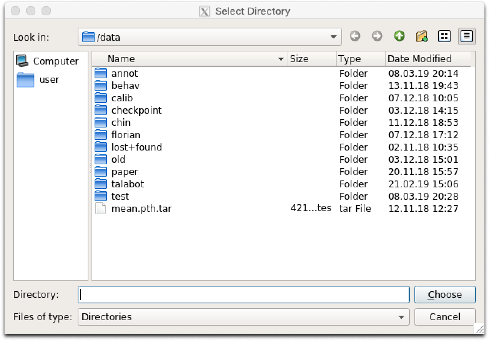

## Running GUI

GUI is primarily used for correcting the false 2D pose estimation results in the 'Correction' mode. Your changes will be saved under df3d folder and will be used for the final df3d_result file. 

**Currently, you can only use GUI after running the df3d on the cli on the same folder.**

After installing the dependencies we can initialize the GUI using the command line entry point:


```
df3d ./data/test/ 15
```
The second argument sets the image folder, while the third argument sets the upper bound for the images, in case you only want to process the subset of images.

This should start the GUI:


you can optionally remove `/FULL/PATH_FOLDER` and `NUM_IMAGES`, in which case pop-up apperas the select the folder. 




After completing pose estimation in the cli, you can open the pose mode:


